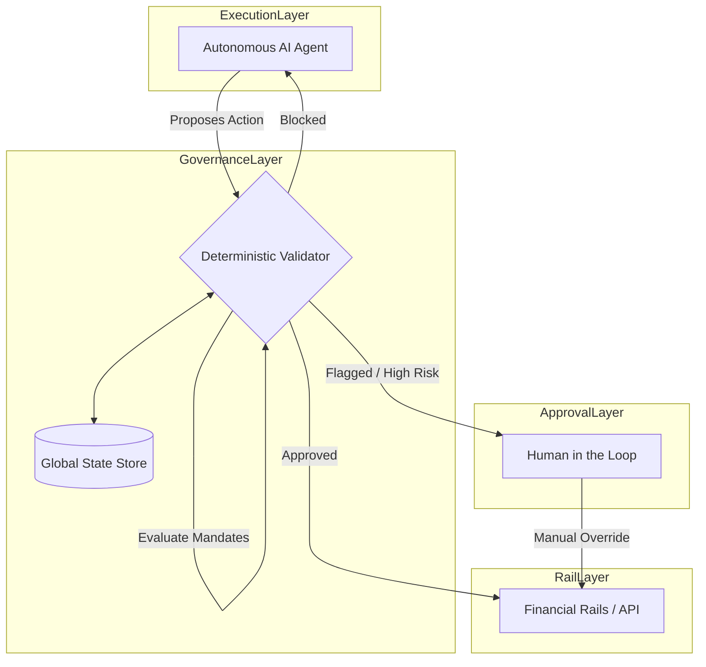
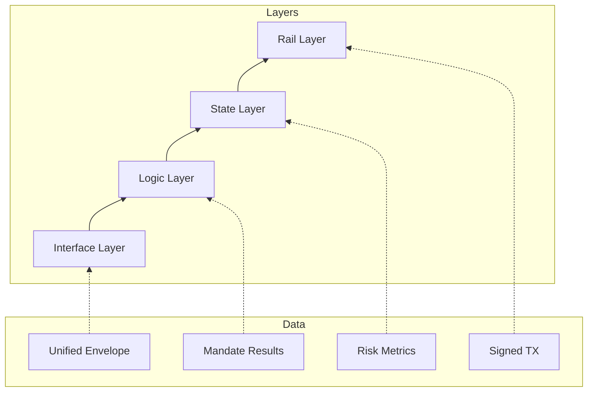
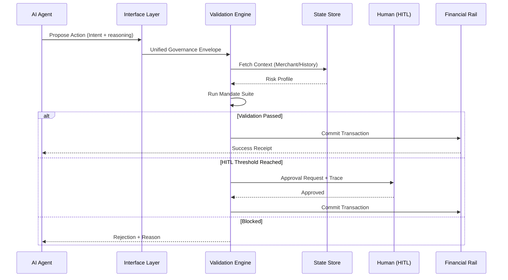

# Foundational Agentic Governance Framework for Financial Services (FAGF-FS)
**Version: 1.0.0-Stable**

## 1. Introduction & Purpose
The **Foundational Agentic Governance Framework for Financial Services (FAGF-FS)** is a standardized specification designed to provide architectural blueprints and operational mandates for the safe deployment of autonomous AI agents in financial ecosystems.

As AI agents transition from advisory roles to transactional execution, FAGF-FS provides the necessary **immutability** and **interpretability** to ensure every movement of capital is governed by both human-defined policy and regulatory mandates.

### 1.1 Core Objectives
- **Risk Mitigation**: Prevent runaway spending, fraudulent redirections, and logic-based exploits.
- **Regulatory Parity**: Map existing financial laws (e.g., MAS, GDPR, Dodd-Frank) into executable code.
- **Operational Transparency**: Ensure every autonomous decision has a verifiable audit trail and logic trace.

---

## 2. Theoretical Architecture

FAGF-FS operates on a **Tiered Validation Logic** (TVL) pattern, separating the "Executor" (the AI Agent) from the "Validator" (the Governance Logic).

### 2.1 The Validator Pattern
The Validator is a standalone, deterministic service that sits between the Agent and the Transactional Rails.



### 2.2 Integration Modalities
1.  **Synchronous (Block-Before-Commit)**: The Rail Layer rejects any request that does not carry a valid "Governance Signature" from the Validator.
2.  **Asynchronous (Monitor-and-Kill)**: The Validator monitors the stream and triggers a reversal or pauses the agent if a mandate is breached post-facto.

### 2.3 The Governance Stack
The framework defines four distinct layers of operation:

| Layer | Responsibility | Output |
| :--- | :--- | :--- |
| **Interface** | Normalization of agent payloads. | `GovernanceEnvelope` |
| **Logic** | Evaluation of deterministic safety rules. | Pass/Fail/HITL |
| **State** | Contextual historical lookups. | Risk Context |
| **Rail** | Cryptographic commit of valid actions. | Transaction Hash |



### 2.4 Validation Lifecycle
The sequence of events from intent to execution:



---

## 3. The Mandate Framework (Policy Layer)

A **Mandate** is the highest level of policy defined in FAGF. It is an abstract safety requirement that is later realized by concrete governance code.

### 3.1 Taxonomy of Mandates
- **AuthZ Mandates**: Focus on "Who" and "Where" (Merchant reputation, Channel security).
- **Spending Mandates**: Focus on "How Much" (Thresholds, Aggregates).
- **Velocity Mandates**: Focus on "How Fast" (Cooldowns, Frequency).
- **Reasoning Mandates**: Focus on "Why" (Strategic alignment, Semantic consistency).

### 3.2 Compliance Mapping
FAGF provides a standard template for mapping regulatory requirements:

| Regulatory Requirement | FAGF Mandate | Implementation |
| :--- | :--- | :--- |
| **AML / Fraud Prevention** | `verify-merchant-01` | Trust-list lookup & IP proximity check. |
| **Consumer Protection** | `spend-limit-daily` | Aggregate daily delta monitoring. |
| **Operational Risk** | `velocity-burst-limit` | Leaky bucket rate limiting. |

---

## 4. Agent-Centric Safety (Logic Layer)

Unlike standard payments logic, Agentic Governance must account for the unique failure modes of Large Language Models (LLMs).

### 4.1 Reasoning Consistency Verification
Governance logic must compare the agent's **Reasoning Payload** against the **Transaction Fragment**.
*   *Fail Case*: Agent says "Paying office rent" but the merchant is "Online Gambling Ltd."
*   *Action*: Immediate high-severity intervention.

### 4.2 Hallucination Filtering
The Validator must proactively verify that the entities mentioned by the agent (Merchant IDs, Bank Codes) exist in the **State Store**. "Hallucinated" merchants are treated as potential spoofing attempts.

---

## 5. Data Models (Technical Layer)

FAGF-FS-compliant implementations MUST adhere to the following core data structures.

### 5.1 The Governance Envelope
Every transaction proposal must be wrapped in a Governance Envelope:

```typescript
interface GovernanceEnvelope {
  transaction: {
    amount: number;
    destination: string;
    category: string;
    timestamp: number;
  };
  reasoning: string;    // Human/Logic readable explanation from the agent
  context: {
    history_depth: number;
    risk_score: number;
  };
}
```

### 5.2 Constraint Definition Structure
```typescript
interface GovernanceMandate {
  id: string;           // Standard FAGF ID (e.g., 'fagf-limit-01')
  parameter: any;       // The limit value
  enforcement: 'block' | 'approval_required' | 'shadow_log';
  riskDisclosure: string; // The specific threat being addressed
}
```

---

## 6. Implementation Scenarios

### 6.1 Low-Trust (Zero-Knowledge) Onboarding
*   **Trigger**: Agent interacts with a merchant not in the historical `State Store`.
*   **Protocol**: Intercept -> Elevate to HITL -> Add to Trust List upon approval.

### 6.2 Bot-Net / Runaway Detection
*   **Trigger**: 10 transactions attempted in 2 seconds.
*   **Protocol**: Trigger `velocity-burst` -> Kill Process -> Alert Admin.

---

## 7. Extending the Framework
Projects can extend FAGF by defining custom **Namespace Mandates**. These must follow the naming convention `ext-[project]-[mandate-id]`.

### 7.1 Best Practices for Extension
- Never disable `fagf-blocklist` mandates in production.
- Always use a secondary "Verifier" model for high-value extensions.
- Ensure all custom mandates provide a `riskDisclosure` for auditability.

## 8. Acknowledgements
The development of FAGF-FS was made possible through the collaboration of AI safety researchers, financial architects, and regulatory compliance experts dedicated to the secure advancement of autonomous agents.

## 9. References & Foundational Standards
The following standards and guidelines were instrumental in the creation of this framework:

- **Monetary Authority of Singapore (MAS)**: 
    - *User Protection Guidelines (E-Payments User Protection Advisory)*.
    - *Technology Risk Management (TRM) Guidelines*.
- **Agentic Payment Protocol 2 (AP2)**: The underlying communication and state-machine standard for autonomous financial agents.
- **ISO 20022**: For financial messaging structure and compatibility.
- **GDPR & Singapore PDPA**: For data privacy and agentic "reasoning" transparency requirements.

---
*End of Specification*
*Published by: Agentic Financial Standards Org (Conceptual)*
