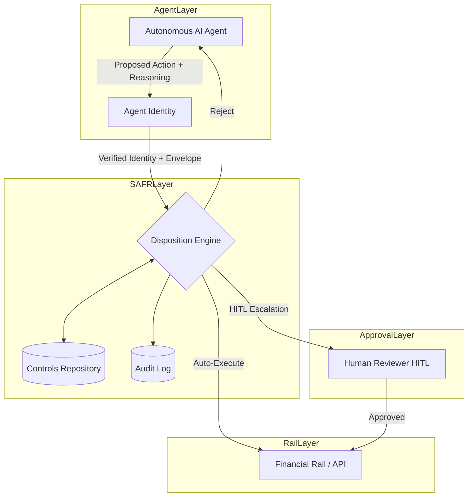
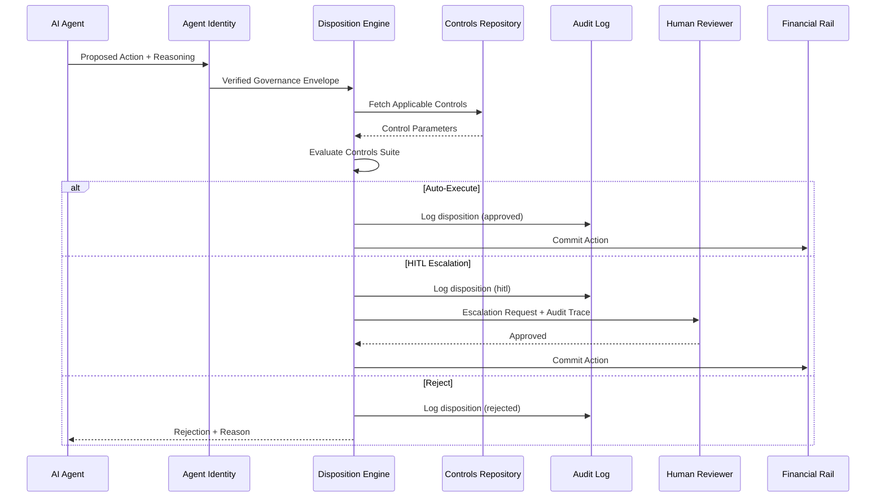

# Safeguards for Agentic Finance at Runtime (SAFR)
**Version: 2.0.0** | Active working specification — contributing to the MAS SAFR initiative

## 1. Introduction & Purpose

**SAFR (Safeguards for Agentic Finance at Runtime)** is a governance framework published by the Monetary Authority of Singapore (MAS) that defines how AI agents in financial services can carry out tasks safely, securely, and reliably. SAFR provides governance checkpoints that verify and record an AI agent's proposed actions before execution occurs.

SAFR builds on MAS Project MindForge's AI Risk Management toolkit and extends those principles specifically to autonomous agent actions at runtime.

### 1.1 Core Objectives
- **Policy-Bound Execution**: All agent actions must comply with pre-configured institutional controls before they are carried out.
- **Real-Time Validation**: Governance checks occur before execution, not after — making post-execution auditing insufficient on its own.
- **Auditability**: Every governance decision is captured in a tamper-evident audit log, including the proposed action, the rules applied, and the outcome.
- **Interoperability**: The framework works across agent architectures through native integration or a gateway model that intercepts API calls from existing agents.

### 1.2 Safeguards vs. Guardrails
This framework distinguishes between two categories of safety measures:

- **Safeguards (SAFR Controls)**: Atomic, deterministic rules enforced by the Disposition Engine before execution (e.g., spending limits, category blocks). Non-probabilistic.
- **Guardrails**: Probabilistic or behavioral safety measures (e.g., content filtering, tone of voice) usually enforced at the LLM gateway layer.

**SAFR focuses on the deterministic control layer to ensure absolute regulatory compliance at the moment of action.**

### 1.3 Relationship to MindForge and FEAT

SAFR controls provide runtime transactional enforcement — the "inner loop" of AI governance. **MAS Project MindForge** provides the broader organizational risk governance framework — the "outer loop" — that contextualizes these controls within a comprehensive AI risk management practice.

The relationship is layered:
- **SAFR Controls Repository**: Atomic, deterministic controls that reject, auto-execute, or escalate individual agent actions in real time.
- **Risk Dimensions (MindForge)**: The 7 organizational risk categories (Accountability, Monitoring, Transparency, Fairness, Legal, Ethics, Cyber Security) that inform *why* controls exist and *how* they should be calibrated.
- **FEAT Principles**: The foundational ethical layer (Fairness, Ethics, Accountability, Transparency) defined by MAS that underpins both frameworks.

This overlay allows institutions to trace any disposition decision back to a risk dimension and an ethical principle, providing end-to-end governance auditability.

---

## 2. SAFR Architecture

### 2.1 Four Core Components

SAFR defines four core components that must be present in any compliant implementation:

| Component | Responsibility |
| :--- | :--- |
| **Agent Identity** | Verifies the AI agent's credentials and the authority delegated to it before any action is evaluated |
| **Controls Repository** | Stores institutional policies, risk parameters, and mandate definitions |
| **Disposition Engine** | Evaluates proposed actions against the Controls Repository in real time and produces a disposition |
| **Audit Log** | Creates a tamper-evident record of each governance decision: the proposed action, the rules applied, and the outcome |

### 2.2 Disposition Outcomes

The Disposition Engine produces exactly one of four outcomes for every proposed agent action:

| Disposition | Meaning | Enforcement |
| :--- | :--- | :--- |
| **Auto-Execute** | Action passes all controls | Proceeds immediately to financial rail |
| **Reject** | Action violates a categorical control | Hard-blocked; cannot proceed |
| **HITL Escalation** | Action exceeds a configurable threshold | Routed to human reviewer before execution |
| **Flag & Monitor** | Action proceeds but is flagged | Logged with elevated scrutiny; `shadow_log` enforcement |

### 2.3 Four Safeguard Principles

All SAFR-compliant implementations must embed these four principles:

1. **Policy-Bound Execution** — Agents may only act within the boundaries defined in the Controls Repository. Actions outside policy are rejected or escalated before execution.
2. **Real-Time Validation** — Governance checks run synchronously, before the action reaches the financial rail.
3. **Auditability** — Every governance decision is written to a tamper-evident audit log with the proposed action, triggered controls, and final disposition.
4. **Interoperability** — The framework must work across agent architectures. Two integration models are supported:
   - *Native Integration*: Agents produce governance records internally before acting.
   - *Gateway Model*: An intercepting layer validates API calls from existing agents.

### 2.4 System Architecture


```mermaid
graph TD
    subgraph AgentLayer
        A[Autonomous AI Agent]
        AI[Agent Identity]
    end

    subgraph SAFRLayer
        CR[(Controls Repository)]
        DE{Disposition Engine}
        AL[(Audit Log)]
        DE <--> CR
        DE --> AL
    end

    subgraph ApprovalLayer
        H[Human Reviewer HITL]
    end

    subgraph RailLayer
        R[Financial Rail / API]
    end

    A -- "Proposed Action + Reasoning" --> AI
    AI -- "Verified Identity + Envelope" --> DE
    DE -- "Auto-Execute" --> R
    DE -- "HITL Escalation" --> H
    H -- "Approved" --> R
    DE -- "Reject" --> A
```

### 2.5 Validation Lifecycle


```mermaid
sequenceDiagram
    participant A as AI Agent
    participant AI as Agent Identity
    participant DE as Disposition Engine
    participant CR as Controls Repository
    participant AL as Audit Log
    participant H as Human Reviewer
    participant R as Financial Rail

    A->>AI: Proposed Action + Reasoning
    AI->>DE: Verified Governance Envelope
    DE->>CR: Fetch Applicable Controls
    CR-->>DE: Control Parameters
    DE->>DE: Evaluate Controls Suite

    alt Auto-Execute
        DE->>AL: Log disposition (approved)
        DE->>R: Commit Action
    else HITL Escalation
        DE->>AL: Log disposition (hitl)
        DE->>H: Escalation Request + Audit Trace
        H-->>DE: Approved
        DE->>R: Commit Action
    else Reject
        DE->>AL: Log disposition (rejected)
        DE-->>A: Rejection + Reason
    end
```

---

## 3. Controls Repository (Policy Layer)

The **Controls Repository** is the institutional source of truth for all policy definitions. It contains a set of named controls, each specifying what is allowed, under what conditions, and what enforcement action to take when a threshold is crossed.

### 3.1 Control Taxonomy

| Category | Focus | Examples |
| :--- | :--- | :--- |
| **Authorization Controls** | Who and Where | Agent identity, merchant trust, payment channel restrictions |
| **Spending Controls** | How Much | Transaction limits, daily aggregate caps |
| **Velocity Controls** | How Fast | Rate limiting, cooldown periods |
| **Category Controls** | What Type | Blocked category lists |

### 3.2 Standard SAFR Control IDs

Controls in the Controls Repository follow the naming convention `safr-[category]-[nn]`:

| Control ID | Category | Default Enforcement |
| :--- | :--- | :--- |
| `safr-auth-01` | authorization | `approval_required` (new merchant) |
| `safr-auth-02` | authorization | `approval_required` (payment channel) |
| `safr-limit-01` | spending_limit | `approval_required` (confirmation threshold) |
| `safr-limit-02` | spending_limit | `block` (daily aggregate hard cap) |
| `safr-velocity-01` | velocity | `approval_required` (rate limit per hour) |
| `safr-velocity-02` | velocity | `approval_required` (cooldown between actions) |
| `safr-cat-01` | category_restriction | `block` (forbidden categories) |

### 3.3 Regulatory Compliance Mapping

| Regulatory Requirement | SAFR Control | Implementation |
| :--- | :--- | :--- |
| **AML / Fraud Prevention** | `safr-auth-01` | Trust-list lookup and new-merchant verification |
| **Consumer Protection** | `safr-limit-02` | Daily aggregate spending cap |
| **Operational Risk** | `safr-velocity-01` | Rate limiting per hour |
| **Restricted Activities** | `safr-cat-01` | Categorical blocklist enforcement |
| **Payment Channel Security** | `safr-auth-02` | Approved payment method restrictions |

---

## 4. Agent-Centric Safety Considerations

Unlike standard payments logic, agentic governance must account for the unique failure modes of Large Language Models (LLMs).

### 4.1 Reasoning Consistency Verification
The Disposition Engine must compare the agent's **Reasoning Payload** against the **Transaction Fragment**.
- *Fail Case*: Agent says "Paying office rent" but the merchant is a gambling platform.
- *Action*: `safr-cat-01` block or HITL escalation depending on category match.

### 4.2 Hallucination Filtering
The Disposition Engine must verify that entities mentioned by the agent (merchant IDs, payment destinations) exist in the Controls Repository trust lists. Unverified entities trigger `safr-auth-01` escalation.

### 4.3 Agent Identity Verification
Before any action is evaluated, the agent's identity and delegated authority must be confirmed. An agent acting outside its authorized scope is rejected regardless of whether the action would otherwise pass the Controls Repository.

---

## 5. Data Models (Technical Layer)

SAFR-compliant implementations MUST adhere to the following core data structures.

### 5.1 The Governance Envelope
Every proposed agent action must be wrapped in a Governance Envelope before reaching the Disposition Engine:

```typescript
interface GovernanceEnvelope {
  transaction: {
    amount: number;
    destination: string;
    merchantName: string;
    category: string;
    timestamp: number;
    paymentMethod: string;
  };
  reasoning: string;    // Agent's explanation, captured in the audit log
  context: {
    isNewMerchant: boolean;
    historyDepth: number;
    riskScore: number;
  };
}
```

### 5.2 Controls Repository Entry (GovernanceMandate)
```typescript
interface GovernanceMandate<T = any> {
  id: string;           // SAFR control ID (e.g., 'safr-limit-01')
  category: 'authorization' | 'spending_limit' | 'category_restriction' | 'velocity';
  parameter: T;         // The control parameter value
  enforcement: 'block' | 'approval_required' | 'shadow_log';
  severity: 'low' | 'medium' | 'high';
  riskDisclosure: string; // The specific threat being mitigated
  description: string;
}
```

### 5.3 Disposition Engine Result
```typescript
interface ValidationResult {
  allowed: boolean;
  requiresApproval: boolean;  // true = HITL Escalation
  reason?: string;            // Human-readable disposition explanation
  mitigationRisk?: string;    // Risk disclosure from the triggered control
  severity?: 'low' | 'medium' | 'high';
  triggeredControls: string[]; // IDs of controls that fired (for audit log)
}
```

### 5.4 MindForge Risk Dimension Assessment
```typescript
interface RiskDimensionAssessment {
  dimension: MindForgeRiskDimension;  // 7 risk dimension identifiers
  label: string;
  score: number;              // 1-5 risk maturity score
  rationale: string;
  controls: string[];         // Active controls for this dimension
  linkedMandateIds: string[]; // Cross-references to safr-* control IDs
}

interface RiskMaterialityAssessment {
  impact: number;             // 1-5
  complexity: number;         // 1-5
  reliance: number;           // 1-5
  overallScore: number;       // impact × complexity × reliance (1-125)
  tier: 'low' | 'medium' | 'high' | 'critical';
}
```

### 5.5 AI System Inventory Entry
```typescript
interface AISystemEntry {
  id: string;                 // e.g., 'ais-safr-001'
  name: string;
  description: string;
  lifecycleStage: 'design' | 'data_collection' | 'training' | 'deployment' | 'monitoring' | 'retirement';
  dataUsed: string[];
  dependencies: string[];     // e.g., ['MAS SAFR White Paper', 'MAS Project MindForge']
  riskMateriality: RiskMaterialityAssessment;
  validationStatus: 'validated' | 'pending' | 'not_assessed';
  owner: string;
  featAlignment: FEATAlignment;
  lifecycleControls: LifecycleControl[];
}
```

---

## 6. MindForge Risk Management Integration

### 6.1 Risk Dimensions
MAS Project MindForge defines 7 AI risk management dimensions. Each dimension maps to one or more SAFR controls:

| MindForge Dimension | Linked SAFR Controls |
| :--- | :--- |
| **Accountability & Governance** | All 7 controls (safr-auth-01, safr-auth-02, safr-limit-01, safr-limit-02, safr-velocity-01, safr-velocity-02, safr-cat-01) |
| **Monitoring & Stability** | safr-velocity-01, safr-velocity-02 |
| **Transparency & Explainability** | safr-limit-01, safr-limit-02 |
| **Fairness & Bias** | safr-cat-01 |
| **Legal & Regulatory** | safr-cat-01, safr-auth-01, safr-limit-02 |
| **Ethics & Impact** | safr-cat-01, safr-auth-01 |
| **Cyber & Data Security** | safr-auth-01, safr-auth-02 |

Each dimension is scored on a 1-5 maturity scale with associated controls and rationale.

### 6.2 Risk Materiality Assessment
The three-axis scoring model determines the level of SAFR controls required:

- **Impact** (1-5): Potential severity of adverse outcomes
- **Complexity** (1-5): Technical sophistication of the AI system
- **Reliance** (1-5): Degree of business dependency on the AI system

**Overall Score** = Impact × Complexity × Reliance (range: 1–125)

| Tier | Score Range | Control Requirement |
| :--- | :--- | :--- |
| Low | 1–15 | Standard controls, periodic review |
| Medium | 16–40 | Enhanced controls, regular monitoring |
| High | 41–80 | Comprehensive controls, continuous monitoring, senior management oversight |
| Critical | 81–125 | Maximum controls, board-level oversight, independent validation, real-time monitoring |

### 6.3 FEAT Principles Alignment
The 14 FEAT principles across 4 pillars provide the ethical foundation for SAFR:

- **Fairness** (3 principles): Justifiable outcomes, data representativeness, outcome monitoring
- **Ethics** (4 principles): Ethical standards compliance, human wellbeing priority, proportionate response, stakeholder impact assessment
- **Accountability** (4 principles): Clear ownership, audit trail, human override capability, remediation process
- **Transparency** (3 principles): Decision explainability, model documentation, disclosure to customers

Each principle links to relevant SAFR controls and requires documented evidence of implementation.

### 6.4 AI System Inventory
All AI systems under SAFR governance must maintain an inventory record containing:
- System identification (id, name, description)
- Current lifecycle stage
- Data sources and dependencies (including SAFR White Paper and MindForge)
- Risk materiality assessment
- Validation status
- System owner
- FEAT alignment score

### 6.5 Lifecycle Controls
Controls are defined across 6 lifecycle stages:

| Stage | Example Controls |
| :--- | :--- |
| Design | Risk appetite definition, regulatory requirement mapping, stakeholder impact assessment |
| Data Collection | Data quality validation, bias detection in training data |
| Training | Performance benchmarking, adversarial robustness testing |
| Deployment | SAFR Controls Repository activation, canary deployment with rollback, production readiness review |
| Monitoring | Real-time action monitoring, drift detection and alerting, periodic model revalidation |
| Retirement | Graceful decommissioning plan, data retention compliance |

---

## 7. Implementation Scenarios

### 7.1 Low-Trust (Zero-Knowledge) Onboarding
- **Trigger**: Agent interacts with a merchant not in the Controls Repository trust list.
- **Protocol**: `safr-auth-01` fires → HITL Escalation → Human adds to trust list upon approval → Audit log records the onboarding decision.

### 7.2 Runaway Agent Detection
- **Trigger**: Agent exceeds rate limit (e.g., 10 transactions in rapid succession).
- **Protocol**: `safr-velocity-01` fires → HITL Escalation → Admin alerted → Cooldown enforced via `safr-velocity-02`.

### 7.3 Categorical Compliance Block
- **Trigger**: Agent attempts action in a restricted category (gambling, unlicensed crypto).
- **Protocol**: `safr-cat-01` fires → Hard Reject → Reason logged in audit log → Agent receives rejection with explanation.

---

## 8. Extending the Framework

Institutions can extend SAFR by defining custom controls in the Controls Repository. Custom controls MUST follow the naming convention `ext-[institution]-[control-id]`.

### 8.1 Best Practices for Extension
- Never disable `safr-cat-01` (category blocklist) controls in production.
- All custom controls must provide a `riskDisclosure` field for audit log completeness.
- Custom controls should be linked to MindForge risk dimensions for governance traceability.
- Use a secondary verification step for controls that govern high-value or irreversible actions.

---

## 9. References & Foundational Standards

- **MAS SAFR White Paper** (2026): *Safeguards for Agentic Finance at Runtime* — primary specification source.
- **MAS Project MindForge AI Risk Management Toolkit**: Strategic and operational guidance for AI risk management in financial institutions.
  - *Executive Handbook* (Nov 2025): Board and senior management guidance.
  - *Operationalisation Handbook* (Jan 2026): Practical implementation guidance.
- **MAS FEAT Principles** (2018): Fairness, Ethics, Accountability, and Transparency principles for AI in Singapore's financial sector.
- **Veritas Initiative** (2020–2023): Methodology for assessing FEAT compliance.
- **MAS Technology Risk Management (TRM) Guidelines**: Technology risk management requirements for financial institutions.
- **Singapore PDPA**: Data privacy and agentic reasoning transparency requirements.
- **MAS AML/CFT Requirements**: Anti-money laundering and counter-financing of terrorism obligations.
- **ISO 20022**: Financial messaging structure and compatibility standards.

---

## 10. Contributing

This specification is a living document developed as part of active SAFR working group contributions. The data models, control taxonomies, disposition logic, and MindForge integration patterns defined here are implemented in the accompanying source code and iterated against real financial use cases.

Proposed changes to control definitions, disposition outcomes, or risk dimension mappings should be raised as issues or pull requests. All changes are considered in the context of alignment with the MAS SAFR White Paper and MindForge guidelines.

---

*Active working specification — contributing to the MAS SAFR initiative (2026)*
