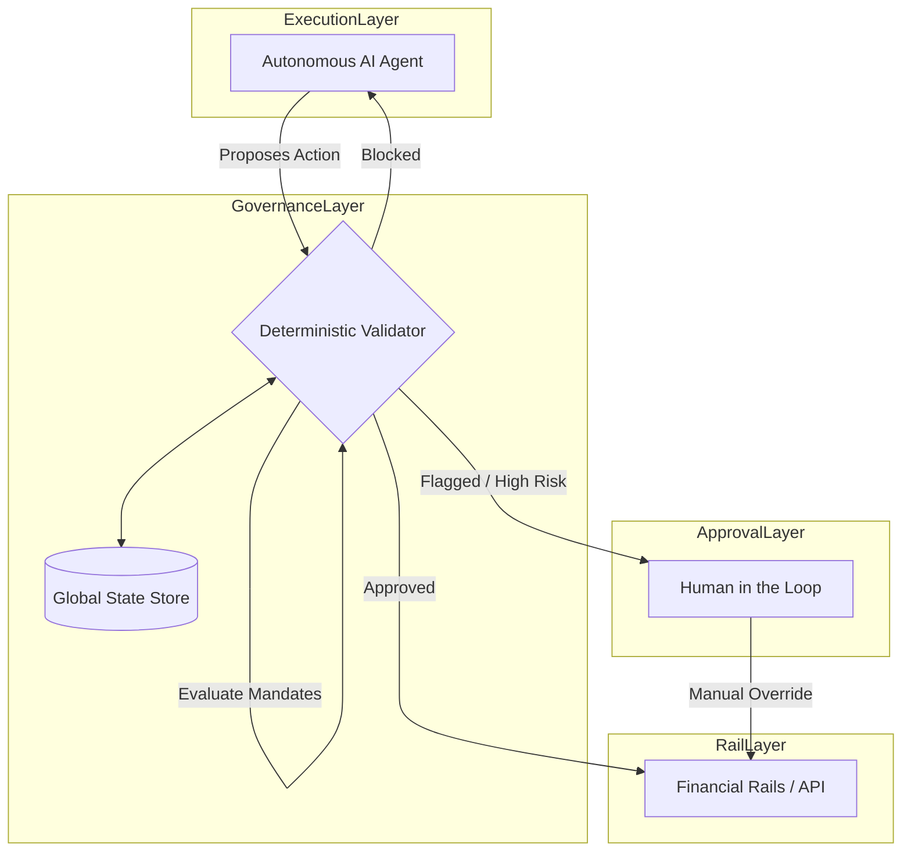
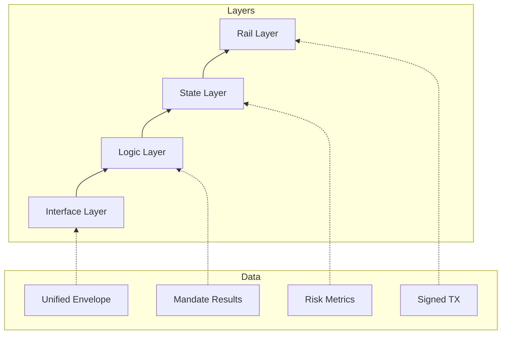
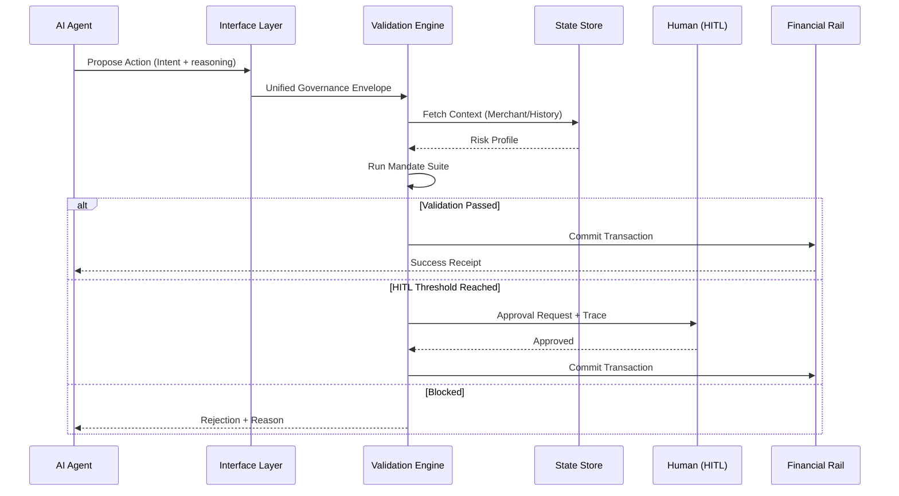

# Foundational Agentic Governance Framework for Financial Services (FAGF-FS)
**Version: 1.1.0-Stable**

## 1. Introduction & Purpose
The **Foundational Agentic Governance Framework for Financial Services (FAGF-FS)** is a standardized specification designed to provide architectural blueprints and operational mandates for the safe deployment of autonomous AI agents in financial ecosystems.

As AI agents transition from advisory roles to transactional execution, FAGF-FS provides the necessary **immutability** and **interpretability** to ensure every movement of capital is governed by both human-defined policy and regulatory mandates.

### 1.1 Core Objectives
- **Risk Mitigation**: Prevent runaway spending, fraudulent redirections, and logic-based exploits.
- **Regulatory Parity**: Map existing financial laws (e.g., MAS, GDPR, Dodd-Frank) into executable code.
- **Operational Transparency**: Ensure every autonomous decision has a verifiable audit trail and logic trace.
- **Risk Governance Alignment**: Integrate MAS Project MindForge risk management practices for comprehensive AI risk oversight across 7 dimensions.

### 1.2 Mandates vs. Guardrails
This framework distinguishes between deterministic and probabilistic safety measures:

- **Mandates**: Atomic, deterministic rules (non-probabilistic). They are the "Financial Laws" enforced by the Validator (e.g., spending limits).
- **Guardrails**: Probabilistic or behavioral safety measures (e.g., content filtering, tone of voice) usually enforced at the LLM gateway.

**FAGF-FS focuses primarily on the Mandate layer to ensure absolute regulatory compliance.**

### 1.3 MindForge Risk Management Overlay
FAGF-FS mandates provide deterministic transactional enforcement -- the "inner loop" of AI governance. **MAS Project MindForge** provides the broader organizational risk governance framework -- the "outer loop" -- that contextualizes these mandates within a comprehensive AI risk management practice.

The relationship is layered:
- **Mandates** (FAGF-FS): Atomic, deterministic controls that block, approve, or escalate individual transactions in real time.
- **Risk Dimensions** (MindForge): The 7 organizational risk categories (Accountability, Monitoring, Transparency, Fairness, Legal, Ethics, Cyber Security) that inform *why* mandates exist and *how* they should be calibrated.
- **FEAT Principles**: The foundational ethical layer (Fairness, Ethics, Accountability, Transparency) defined by MAS that underpins both frameworks.

This overlay allows institutions to trace any mandate enforcement back to a risk dimension and ethical principle, providing end-to-end governance auditability.

---

## 2. Theoretical Architecture

FAGF-FS operates on a **Tiered Validation Logic** (TVL) pattern, separating the "Executor" (the AI Agent) from the "Validator" (the Governance Logic).

### 2.1 The Validator Pattern
The Validator is a standalone, deterministic service that sits between the Agent and the Transactional Rails.


```mermaid
graph TD
    subgraph ExecutionLayer
        A[Autonomous AI Agent]
    end
    
    subgraph GovernanceLayer
        V{Deterministic Validator}
        S[(Global State Store)]
        V <--> S
    end
    
    subgraph ApprovalLayer
        H[Human in the Loop]
    end
    
    subgraph RailLayer
        R[Financial Rails / API]
    end

    A -- "Proposes Action" --> V
    V -- "Evaluate Mandates" --> V
    V -- "Approved" --> R
    V -- "Flagged / High Risk" --> H
    H -- "Manual Override" --> R
    V -- "Blocked" --> A
```

### 2.2 Integration Modalities
1.  **Synchronous (Block-Before-Commit)**: The Rail Layer rejects any request that does not carry a valid "Governance Signature" from the Validator.
2.  **Asynchronous (Monitor-and-Kill)**: The Validator monitors the stream and triggers a reversal or pauses the agent if a mandate is breached post-facto.

### 2.3 The Governance Stack
The framework defines four distinct layers of operation:

| Layer | Responsibility | Output |
| :--- | :--- | :--- |
| **Interface** | Normalization of agent payloads. | `GovernanceEnvelope` |
| **Logic** | Evaluation of deterministic safety rules. | Pass/Fail/HITL |
| **State** | Contextual historical lookups. | Risk Context |
| **Rail** | Cryptographic commit of valid actions. | Transaction Hash |


```mermaid
graph BT
    subgraph Layers
        L1[Rail Layer]
        L2[State Layer]
        L3[Logic Layer]
        L4[Interface Layer]
    end
    L4 --> L3
    L3 --> L2
    L2 --> L1
    
    subgraph Data
        D1[Signed TX]
        D2[Risk Metrics]
        D3[Mandate Results]
        D4[Unified Envelope]
    end
    D4 -.-> L4
    D3 -.-> L3
    D2 -.-> L2
    D1 -.-> L1
```

### 2.4 Validation Lifecycle
The sequence of events from intent to execution:


```mermaid
sequenceDiagram
    participant A as AI Agent
    participant I as Interface Layer
    participant V as Validation Engine
    participant S as State Store
    participant H as Human (HITL)
    participant R as Financial Rail

    A->>I: Propose Action (Intent + reasoning)
    I->>V: Unified Governance Envelope
    V->>S: Fetch Context (Merchant/History)
    S-->>V: Risk Profile
    V->>V: Run Mandate Suite
    
    alt Validation Passed
        V->>R: Commit Transaction
        R-->>A: Success Receipt
    else HITL Threshold Reached
        V->>H: Approval Request + Trace
        H-->>V: Approved
        V->>R: Commit Transaction
    else Blocked
        V-->>A: Rejection + Reason
    end
```

---

## 3. The Mandate Framework (Policy Layer)

A **Mandate** is the highest level of policy defined in FAGF. It is an abstract safety requirement that is later realized by concrete governance code.

### 3.1 Taxonomy of Mandates
- **AuthZ Mandates**: Focus on "Who" and "Where" (Merchant reputation, Channel security).
- **Spending Mandates**: Focus on "How Much" (Thresholds, Aggregates).
- **Velocity Mandates**: Focus on "How Fast" (Cooldowns, Frequency).
- **Reasoning Mandates**: Focus on "Why" (Strategic alignment, Semantic consistency).

### 3.2 Compliance Mapping
FAGF provides a standard template for mapping regulatory requirements:

| Regulatory Requirement | FAGF Mandate | Implementation |
| :--- | :--- | :--- |
| **AML / Fraud Prevention** | `verify-merchant-01` | Trust-list lookup & IP proximity check. |
| **Consumer Protection** | `spend-limit-daily` | Aggregate daily delta monitoring. |
| **Operational Risk** | `velocity-burst-limit` | Leaky bucket rate limiting. |

---

## 4. Agent-Centric Safety (Logic Layer)

Unlike standard payments logic, Agentic Governance must account for the unique failure modes of Large Language Models (LLMs).

### 4.1 Reasoning Consistency Verification
Governance logic must compare the agent's **Reasoning Payload** against the **Transaction Fragment**.
*   *Fail Case*: Agent says "Paying office rent" but the merchant is "Online Gambling Ltd."
*   *Action*: Immediate high-severity intervention.

### 4.2 Hallucination Filtering
The Validator must proactively verify that the entities mentioned by the agent (Merchant IDs, Bank Codes) exist in the **State Store**. "Hallucinated" merchants are treated as potential spoofing attempts.

---

## 5. Data Models (Technical Layer)

FAGF-FS-compliant implementations MUST adhere to the following core data structures.

### 5.1 The Governance Envelope
Every transaction proposal must be wrapped in a Governance Envelope:

```typescript
interface GovernanceEnvelope {
  transaction: {
    amount: number;
    destination: string;
    category: string;
    timestamp: number;
  };
  reasoning: string;    // Human/Logic readable explanation from the agent
  context: {
    history_depth: number;
    risk_score: number;
  };
}
```

### 5.2 Constraint Definition Structure
```typescript
interface GovernanceMandate {
  id: string;           // Standard FAGF ID (e.g., 'fagf-limit-01')
  parameter: any;       // The limit value
  enforcement: 'block' | 'approval_required' | 'shadow_log';
  riskDisclosure: string; // The specific threat being addressed
}
```

### 5.3 MindForge Data Structures

```typescript
interface RiskDimensionAssessment {
  dimension: MindForgeRiskDimension;  // 7 risk dimension identifiers
  label: string;
  score: number;            // 1-5 risk maturity score
  rationale: string;
  controls: string[];
  linkedMandateIds: string[]; // Cross-references to fagf-* mandate IDs
}

interface RiskMaterialityAssessment {
  impact: number;           // 1-5
  complexity: number;       // 1-5
  reliance: number;         // 1-5
  overallScore: number;     // impact * complexity * reliance (1-125)
  tier: 'low' | 'medium' | 'high' | 'critical';
}

interface AISystemEntry {
  id: string;
  name: string;
  description: string;
  lifecycleStage: LifecycleStage;
  dataUsed: string[];
  dependencies: string[];
  riskMateriality: RiskMaterialityAssessment;
  validationStatus: 'validated' | 'pending' | 'not_assessed';
  owner: string;
  featAlignment: FEATAlignment;
  lifecycleControls: LifecycleControl[];
}

interface FEATPrinciple {
  id: string;
  pillar: 'fairness' | 'ethics' | 'accountability' | 'transparency';
  name: string;
  description: string;
  implemented: boolean;
  evidenceNotes: string;
  linkedMandateIds: string[];
}
```

---

## 6. Implementation Scenarios

### 6.1 Low-Trust (Zero-Knowledge) Onboarding
*   **Trigger**: Agent interacts with a merchant not in the historical `State Store`.
*   **Protocol**: Intercept -> Elevate to HITL -> Add to Trust List upon approval.

### 6.2 Bot-Net / Runaway Detection
*   **Trigger**: 10 transactions attempted in 2 seconds.
*   **Protocol**: Trigger `velocity-burst` -> Kill Process -> Alert Admin.

---

## 7. Extending the Framework
Projects can extend FAGF by defining custom **Namespace Mandates**. These must follow the naming convention `ext-[project]-[mandate-id]`.

### 7.1 Best Practices for Extension
- Never disable `fagf-blocklist` mandates in production.
- Always use a secondary "Verifier" model for high-value extensions.
- Ensure all custom mandates provide a `riskDisclosure` for auditability.

## 8. MindForge Risk Management Integration

### 8.1 Risk Dimensions
MAS Project MindForge defines 7 AI risk management dimensions. Each dimension maps to one or more FAGF-FS mandates:

| MindForge Dimension | Linked FAGF-FS Mandates |
| :--- | :--- |
| **Accountability & Governance** | All 7 mandates (fagf-auth-01, fagf-auth-02, fagf-limit-01, fagf-limit-02, fagf-velocity-01, fagf-velocity-02, fagf-cat-01) |
| **Monitoring & Stability** | fagf-velocity-01, fagf-velocity-02 |
| **Transparency & Explainability** | fagf-limit-01, fagf-limit-02 |
| **Fairness & Bias** | fagf-cat-01 |
| **Legal & Regulatory** | fagf-cat-01, fagf-auth-01, fagf-limit-02 |
| **Ethics & Impact** | fagf-cat-01, fagf-auth-01 |
| **Cyber & Data Security** | fagf-auth-01, fagf-auth-02 |

Each dimension is scored on a 1-5 maturity scale with associated controls and rationale.

### 8.2 Risk Materiality Assessment
The three-axis scoring model determines the level of governance controls required:

- **Impact** (1-5): Potential severity of adverse outcomes
- **Complexity** (1-5): Technical sophistication of the AI system
- **Reliance** (1-5): Degree of business dependency on the AI system

**Overall Score** = Impact × Complexity × Reliance (range: 1-125)

| Tier | Score Range | Control Requirement |
| :--- | :--- | :--- |
| Low | 1-15 | Standard controls, periodic review |
| Medium | 16-40 | Enhanced controls, regular monitoring |
| High | 41-80 | Comprehensive controls, continuous monitoring |
| Critical | 81-125 | Maximum controls, board-level oversight |

### 8.3 FEAT Principles Alignment
The 14 FEAT principles across 4 pillars provide the ethical foundation:

- **Fairness** (3 principles): Justifiable outcomes, data representativeness, outcome monitoring
- **Ethics** (4 principles): Ethical standards, human wellbeing, proportionate response, stakeholder assessment
- **Accountability** (4 principles): Clear ownership, audit trail, human override, remediation
- **Transparency** (3 principles): Decision explainability, model documentation, customer disclosure

Each principle links to relevant FAGF-FS mandates and requires evidence of implementation.

### 8.4 AI System Inventory
All AI systems under governance must maintain an inventory record containing:
- System identification (id, name, description)
- Current lifecycle stage (design, data_collection, training, deployment, monitoring, retirement)
- Data sources and dependencies
- Risk materiality assessment
- Validation status
- System owner
- FEAT alignment score

### 8.5 Lifecycle Controls
Controls are defined across 6 lifecycle stages:

| Stage | Example Controls |
| :--- | :--- |
| Design | Risk appetite definition, regulatory requirement mapping |
| Data Collection | Data quality validation, bias detection |
| Training | Performance benchmarking, adversarial testing |
| Deployment | Mandate enforcement activation, production readiness review |
| Monitoring | Real-time transaction monitoring, drift detection |
| Retirement | Graceful decommissioning, data retention compliance |

---

## 9. Acknowledgements
The development of FAGF-FS was made possible through the collaboration of AI safety researchers, financial architects, and regulatory compliance experts dedicated to the secure advancement of autonomous agents.

## 10. References & Foundational Standards
The following standards and guidelines were instrumental in the creation of this framework:

- **Monetary Authority of Singapore (MAS)**: 
    - *User Protection Guidelines (E-Payments User Protection Advisory)*.
    - *Technology Risk Management (TRM) Guidelines*.
- **Agentic Payment Protocol 2 (AP2)**: The underlying communication and state-machine standard for autonomous financial agents.
- **ISO 20022**: For financial messaging structure and compatibility.
- **GDPR & Singapore PDPA**: For data privacy and agentic "reasoning" transparency requirements.
- **MAS Project MindForge**: AI Risk Management Toolkit for financial institutions.
- **MindForge AI Risk Management Executive Handbook** (Nov 2025): Strategic guidance for board and senior management.
- **MindForge AI Risk Management Operationalisation Handbook** (Jan 2026): Practical implementation guidance.
- **MAS FEAT Principles** (2018): Fairness, Ethics, Accountability, and Transparency principles for AI in finance.
- **Veritas Initiative** (2020-2023): Methodology for assessing FEAT compliance.

---
*End of Specification*
*Published by: Agentic Financial Standards Org (Conceptual)*
